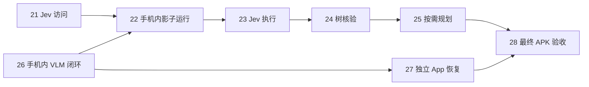

# 首版实施任务索引

2026-09-22：用户已确认本规格及 28 项拆分。2026-09-25：按独立 App 要求修订，编号仍为 01–28；01–20 保留原环境验收，21–28 承接新运行边界，实际状态以票头为准。唯一执行队列为本目录；旧 mobile-agent-development 的 21 项保留为来源，不再领取、不改写为完成。

[首版规格](spec.md)定义交付行为与测试边界；[开发路线](../../docs/development-roadmap.md)定义阶段门槛；[并行协作](../../docs/parallel-development.md)定义领取和合入。任务进度只记录在各票中。

## 任务与依赖

| 编号 | 任务 | Blocked by | 证据层级 |
| --- | --- | --- | --- |
| 01 | [一个模拟任务从提交到独立判定完成](issues/01-simulated-task-loop.md) | 无 | 离线行为 |
| 02 | [给成功、失败和未知任务生成独立判分报告](issues/02-independent-evaluation.md) | 无 | 离线行为 |
| 03 | [运行中的任务可以暂停和取消](issues/03-pause-cancel.md) | 01 | 离线行为 |
| 04 | [断线和重启后核对并手动恢复模拟任务](issues/04-reconcile-resume.md) | 03 | 离线行为 |
| 05 | [旧目标与重复命令不会产生额外动作](issues/05-valid-action-delivery.md) | 01 | 离线行为 |
| 06 | [在模拟器中连接 App 并查看当前观察](issues/06-android-observation.md) | 01 | Android 模拟器 |
| 07 | [从 App 发起中文输入任务并控制执行](issues/07-android-node-task.md) | 03, 05, 06 | Android 模拟器 |
| 08 | [手势与截图支持完成受控页面任务](issues/08-android-visual-task.md) | 07 | Android 模拟器 |
| 09 | [回放模型响应驱动任务并处理服务错误](issues/09-model-replay-task.md) | 01 | 离线行为 |
| 10 | [运行一次任务即可获得轨迹、判分和费用报告](issues/10-task-evidence.md) | 02, 09 | 离线行为 |
| 11 | [离线候选选择可以执行或明确回退](issues/11-offline-selection.md) | 01, 02 | 离线行为 |
| 12 | [四态核验驱动等待、回退或停止](issues/12-offline-verification.md) | 01, 02 | 离线行为 |
| 13 | [提供真实 VLM 最小访问条件](issues/13-human-vlm-access.md) | 无 | 用户访问条件 |
| 14 | [提供物理手机与首轮任务授权](issues/14-human-phone-access.md) | 无 | 用户访问条件 |
| 15 | [真实 VLM 能完成所需角色协议请求](issues/15-live-vlm-compatibility.md) | 09, 13 | 真实模型 API |
| 16 | [分别运行原真机与四角色最小基线](issues/16-original-baselines.md) | 02, 14, 15 | 真实 API、AndroidWorld、物理手机 |
| 17 | [提取角色后在参考设备后端保持任务行为](issues/17-extract-roles.md) | 01, 16 | 真实 API、参考设备后端 |
| 18 | [裁剪后仍能复现已建立的对照](issues/18-prune-with-regression.md) | 17 | 参考任务实测 |
| 19 | [用户通过 App 完成仅 VLM 的真实任务](issues/19-vlm-app-loop.md) | 08, 10, 14, 18 | 真实 API 与物理手机 |
| 20 | [真实手机中断后可核对并手动恢复](issues/20-real-device-recovery.md) | 04, 19 | 真实 API 与物理手机 |
| 21 | [验证已提供的 Jev 实测访问条件](issues/21-human-jev-access.md) | 无 | 真实 Jev 访问探针 |
| 22 | [真实 Jev 在 VLM 任务旁提供可评估建议](issues/22-jev-shadow.md) | 11, 21, 26 | 真实模型、物理手机影子运行 |
| 23 | [Jev 选择参与真实任务执行](issues/23-jev-controlled.md) | 22 | 真实模型与物理手机 |
| 24 | [树核验参与真实任务且证据不足可回退](issues/24-tree-verification.md) | 12, 23 | 真实模型与物理手机 |
| 25 | [按需规划完成任务并处理计划失效](issues/25-on-demand-planning.md) | 24 | 真实模型与物理手机 |
| 26 | [安装 App 并填写 Key 后完成手机内 VLM 任务](issues/26-app-local-vlm.md) | 19, 20 | 独立 APK、真实 VLM、物理手机 |
| 27 | [独立 App 中断后核对并手动恢复](issues/27-standalone-recovery.md) | 20, 26 | 独立 APK、物理手机恢复演练 |
| 28 | [最终集成版本通过完整对照与交付复核](issues/28-final-integrated-acceptance.md) | 25, 27 | 最终独立 APK 与物理手机 |

## 开始与用户参与

当前 21 的 Jev 访问、26 的手机内 VLM 拔线闭环、22 的手机内影子建议评估均已完成。用户已提供统一测试凭据 `jev-test.env`，不再请求服务器资源。剩余 23、24、25、27、28 共五项；可启动 23 的受控选择执行与 27 的恢复开发，涉及同一运行入口/持久化时串行，之后 23 → 24 → 25，最终 25/27 → 28。

图展示当前阶段的依赖；已完成的 11/12/19/20 前置保留在票头。21 与 26 无依赖关系，涉及同一 Android 运行入口/持久化的 22 与 27 修改必须指定唯一所有者或串行；同一真机测试串行进行。编号是稳定身份，不等于执行顺序，不为调整架构扩张任务数量。

01–20 不重新标为 pending，也不重新执行所有基线。迁移后复用未变的设备能力、场景和判据，对运行时变化重新取得 26/27 的手机证据；既有双端恢复与本地部署记录不能替代独立 App 验收。用户参与仅在真实模型账号或手机系统授权出现不可代办缺口时触发，明确说明获取方式。

## 旧任务覆盖

旧任务保留为来源，不关闭、不改写其历史记录。新目录发布后，开发入口明确只从新任务领取，旧索引通过入口说明转为历史规划参考。

| 原 21 项编号与内容 | 新任务 |
| --- | --- |
| 01 共享契约与工程布局 | 01 起步；03–09 按行为扩展，协调者管理共享所有权 |
| 02 模型协议兼容性 | 09、15、22 |
| 03 任务样本与独立判分 | 02、10、14 |
| 04 API 与设备访问 | 13、14、21，按需拆开 |
| 05 原版双入口基线 | 16 |
| 06 角色提取 | 17 |
| 07 裁剪与复验 | 18 |
| 08 Android 观察 | 06；19 补物理手机证据 |
| 09 Android 执行/截图/控制 | 07、08；19–20 补物理手机证据 |
| 10 服务端会话 | 01、03–05 |
| 11 轨迹/回放/费用 | 09、10，真实阶段补实测 |
| 12 仅 VLM 闭环 | 19 |
| 13 候选与离线选择 | 11、22 |
| 14 Jev 影子与受控执行 | 22、23 |
| 15 四态数据/核验 | 12、24 |
| 16 树核验接入 | 24 |
| 17 按需规划 | 25 |
| 18 故障恢复/接管 | 03、04、20 |
| 19 服务器访问 | 当前撤销，旧材料仅作历史参考；26 已替换为手机内闭环 |
| 20 脱离 ADB 部署验收 | 27 改为独立 App 恢复与无电脑运行 |
| 21 完整对照与交付 | 28 |

没有把任务数增加解释为产品范围扩大：开发、真实验证和必须人工完成的访问条件现在各有明确结果。基线与裁剪属于必要前置验证/重构，不为了形式将它们伪装成用户新功能。

## 确认记录

2026-09-22：按 to-spec/to-tickets 完成规格综合、测试边界和逐项依赖草案。用户回复“确认”，接受任务粒度、依赖与延后人工准备。

2026-09-25：用户明确“独立 App 就能正常运行”；spec、ADR-0003、21–28 与本索引同步修订。旧 26/27 服务器标题由 Git 历史保留。
