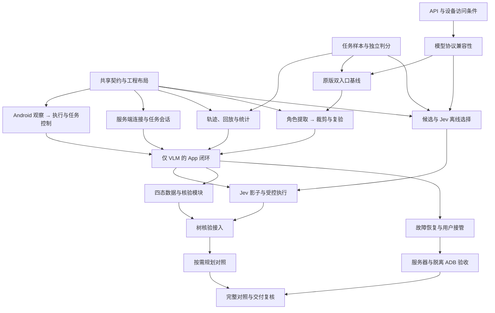

# Jev-MobileAgent 开发路线

更新：2026-09-22。本文是后续开发的调度入口，依据[项目方向](project-direction.md)和[阶段验证方案](research/2026-09-22-stages-evaluation-and-flows.md)整理。公开 Fork、文档与技能初始化已完成；下面的开发任务尚未实施，模型、App 和真机结果均未验收。

## 1. 交付目标

首版让一个用户在一台 Android 手机上发起一个任务，由 App 获取可访问界面信息并执行操作，服务端使用 v3.5 的规划与视觉能力、Jev 的候选选择与核验形成闭环。最终在拔掉 USB、停止开发机 ADB 后仍可完成约定的中文任务；断线、重启或人工介入后先暂停，核对现场后由用户确认恢复。

首个可用里程碑是“App 设备桥 + 仅 VLM 的闭环”，然后逐项加入 Jev 选择、树核验和按需规划。首版不包括多用户、多设备调度、同机并发任务、应用商店发布、离线本地大模型或模型训练。价格、成功率、延迟与收益通过对照测量，不预先承诺提升幅度。

本文确定开发顺序、职责和验收；具体字段、传输与存储选型由“共享契约与工程布局”任务产出。后续任务不得把本页中的模块名称误认为已存在的实现。

## 2. 从哪里开始

1. 阅读[领域词汇](../CONTEXT.md)、[项目方向](project-direction.md)与本页。
2. 在[任务索引](../.scratch/mobile-agent-development/spec.md)中找依赖已经完成、尚无人领取的任务，按[并行协作约定](parallel-development.md)领取。
3. 第一批可以并行：**共享契约与工程布局**、**任务样本与独立判分设计**；用户同时准备 **API 与设备访问条件**。
4. 共享契约合入后，Android、服务端、评测工具可以使用同一组协议样例开发；真实 API 与设备检查走独立验证链。
5. 阶段门槛全部有证据后，由集成负责人开放下一阶段。Mock 通过只能证明对应接口与控制逻辑，不能关闭真实能力验收。

上游代码起点：`11cea575561fb7800b5fb6b6cafa56f7a91de11f`。工程初始化提交：`831036e725eefd53051a17f671e12047a974c1ef`。每次运行另记代码 SHA、入口、模型和环境；未运行的项目明确写“未验证”。

## 3. 阶段与放行条件

| 阶段 | 这一阶段交付什么 | 放行证据 | 不通过时的处理 |
| --- | --- | --- | --- |
| 准备：共享契约和外部条件 | 两端共用的观察、动作、回执、会话及轨迹契约；任务样本；账号与设备可用性 | 协议样例及校验通过；运行条件逐项登记 | 已有 Mock 的模块可继续开发；依赖真实能力的验收保持未完成 |
| 0：原版基线与代码整理 | 分别跑原真机单模型入口与 AndroidWorld 四角色入口；提取生产角色，再裁剪 | 原始版本或最小修复版本的轨迹；提取前后同条件复验；来源及依赖清单 | 把阻塞原因与修复单独记录；保留原目录，不以“可导入”替代行为对照 |
| 1：App 与 VLM 闭环 | 树、节点动作、手势、截图、任务控制和设备会话接入现有 VLM | 同一动作经 App 通道执行并经重新观察核对；仅 VLM 的完整任务轨迹 | 先查设备、坐标、协议和模型兼容性，保留可工作的对照实现 |
| 2：Jev 选择 | 完整候选构造、Jev 客户端、转视觉；离线 → 影子 → 受控执行 | 候选覆盖、选择错误、缺参、中文、回退数据；受控执行的独立任务判分 | 模块可交付但策略不开启，维持 VLM 路径；记录不适用范围 |
| 3：树结果核验 | 规则 → Jev → 信息不足时视觉；四态及有限等待 | 正反例与四态混淆；误报成功、未知与等待处理；不把回执当效果 | 树证据不足继续视觉或暂停，不能强制产出 SUCCESS |
| 4：按需规划 | 开始、子目标切换与异常触发规划；其余步骤复用计划 | 与阶段 3 的配对对照，覆盖计划过期、停滞、循环和长任务 | 关闭新调度，恢复原规划策略；不能以调用减少掩盖完成质量下降 |
| 5：完整闭环与交付 | 恢复、中文真机、普通服务器运行和脱离 ADB | 所有对照组、故障演练、模型费用、端到端延迟；用户复核的完成证据 | 明确剩余限制与失败场景，未通过项不标记完成 |

阶段对应原研究中的 0–5；准备工作是为并行开发补齐的前置步骤。故障恢复设计从契约阶段开始实现，可靠性工作在阶段 1 后即可并行，不留到最后才发现协议缺口。

## 4. 工作线与代码归属

下表是建议的职责目录；由“共享契约与工程布局”任务确认实际包结构、构建入口和唯一所有者后再创建。目录划分不要求新增多个仓库，也不等于引入多个领域上下文。

| 工作线 | 主要职责 | 预期目录 | 对外必须稳定的接口 |
| --- | --- | --- | --- |
| 契约与集成 | 版本、共享样例、依赖、合入与阶段验收 | `contracts/`、项目根配置、文档和任务台账 | schema、能力表、配置约定、验证入口 |
| Agent 与模型 | 模型适配、角色提取、历史、统一动作、策略调度 | `agent-core/` | 观察到动作、模型响应、核验结果、轨迹事件 |
| Android | 无障碍观察、执行、截图、权限与用户控制 | `android-app/` | 设备能力、观察、执行回执、暂停与恢复 |
| 服务端与会话 | 手机连接、任务状态、命令去重、检查点和部署 | `services/` | 任务/设备生命周期、命令交付、重连与状态核对 |
| 评测与证据 | 可控页面、样例转换、回放、独立判分与成本统计 | `eval/` | 统一轨迹、版本清单、逐步标签和任务终局判分 |

Jev 候选选择与核验属于 Agent 决策模块，网络会话属于服务端；不得分别在两处实现一套策略。模型服务包装与真实设备适配均通过契约接入，Agent 不直接写 ADB/AndroidWorld 环境操作。

人员或 Agent 数量少时可合并工作线，但共享契约、根配置和总文档始终只有一个当前编辑者。

## 5. 并行波次与关键依赖

| 波次 | 可以同时进行 | 汇合条件 |
| --- | --- | --- |
| 第一批 | 契约设计、任务与判分设计、用户准备账号和设备 | 契约先合入，外部准备分别登记，不能相互冒充完成 |
| 基础并行 | Android 观察；服务端会话；轨迹与回放；模型兼容性与原版基线 | 共享样例一致；原版基线有证据后才能开始角色提取与裁剪 |
| 模块并行 | Android 执行；角色提取/裁剪；候选与 Jev 离线模块 | Android 与服务端互测；Agent 与回放适配完成，再进行仅 VLM 集成 |
| 闭环后并行 | Jev 影子/受控执行；四态数据与核验；故障恢复与服务器准备 | 模块离线可独立进行，策略启用顺序仍为选择 → 核验 → 调度 |
| 集成交付 | 按需规划对照与脱离 ADB 运行可并行 | 最终集成提交上重新复核全套关键证据 |

依赖以[每张任务](../.scratch/mobile-agent-development/spec.md)的 `Blocked by` 为准；此图描述主要路径。对于一台物理手机，采集、执行、恢复测试必须预约串行使用，不能由不同工作线同时操作。

## 6. 共享契约必须先回答的问题

“共享契约与工程布局”任务完成以下内容并提供机器可校验的样例；本路线不把尚未讨论和验证的字段假装成冻结协议。

| 契约 | 必须覆盖的语义 | 需要的反例 |
| --- | --- | --- |
| 观察和能力 | 窗口、包名、尺寸/旋转、采集时间、观察版本、临时节点引用、支持动作、树/截图缺失原因 | 树为空、多窗口、节点失效、截图受限、服务权限撤销 |
| 坐标与图像 | 原始屏幕、模型输入缩放及旋转的映射；截图与观察的关联 | 转屏、缩放、系统栏、窗口偏移、旧截图配新树 |
| 动作 | 完整目标/参数、观察绑定、动作来源、可执行能力校验；文本来源可追溯 | 缺文本、未知动作、越界坐标、过期候选、目标被遮挡 |
| 回执与核验 | 区分受理、执行过程和后置条件；回执丢失与结果未知分别表达 | 命令超时但动作可能已发生、派发成功但页面没变化 |
| 会话与控制 | 设备身份/配对、一个在途动作、去重身份、持久化边界、取消、暂停、重连和用户确认恢复 | 重复/乱序命令、两端重启、暂停后迟到模型响应、旧连接发来的命令 |
| 模型与策略 | 输入、输出、错误、超时/重试边界、版本与 usage；各实验开关独立 | 模型格式错误、服务限流、未知字段、供应商 usage 缺失 |
| 轨迹与判分 | 每次尝试、观察/动作/核验链、角色与来源、费用、时延、独立真值 | 不计失败费用、把 UNKNOWN 当 SUCCESS、把最终失败标成每步失败 |

还需确定手机发起连接的传输方式、认证、截图传输方式、协议兼容策略、Python 与 Android 工程入口、检查点存储方式及运行预算配置。小范围技术方案由负责人记录理由后确定；若需要改变已确认的产品边界，则回到用户讨论。

契约变更先改版本与样例，再修改消费者；存在破坏性变更时同时列出受影响任务与迁移方式。消费者只在共同确认的版本上并行。

## 7. 代码复用与验证顺序

- 真机单模型参考：`Mobile-Agent-v3.5/mobile_use/`。保留其“截图、历史、决策、执行”的独立对照，不把它叫作四角色基线。
- 角色来源：`Mobile-Agent-v3.5/android_world_v3.5/android_world/agents/mobile_agent_v3.py`、`mobile_agent_v3_agent.py`、`infer_ma3.py`。提取 Manager、Executor、ActionReflector、Notetaker 与 InfoPool，处理固定尺寸、任务特例和环境耦合。
- 上游 `file://` 图片处理、动作声明/分派覆盖与坐标换算疑点先复现，确需修复时独立提交和记录。静态疑点的出处见[源码证据](research/mobileagent-evidence.md)。
- 目录移动/删除、基线修复和功能策略分别提交。删除前生成实际依赖与来源清单；原基线与提取后对照可运行后才执行裁剪。
- 第三方设备端项目作为可选参考；目前没有批准直接引入 Portal 代码。若拟引入外部代码，在对应任务先确定复用范围和许可证处理，不把“参考过”当作依赖已选定。

## 8. 验收与证据口径

采用五组逐项启用的生产对照：提取后 VLM + 参考设备后端、仅替换 App 设备桥、增加 JevSelector、增加树核验、增加按需规划。另保留原真机单模型与原 AndroidWorld 四角色的独立基线，不能将入口差异算作 Jev 收益。

每次记录代码 SHA、模型/提示词/配置版本、任务和初始状态、设备/App 版本、种子或重复编号、任务预算及判分方式。固定同一比较条件；失败、取消、重试和回退都纳入总尝试。若不能得到可靠 usage，报告缺失与账单来源，不补造费用。

证据分三层：

1. **契约与回放**：schema、一致性、过期目标、重复命令、四态及状态转换；使用合成或脱敏样例，可在没有模型和设备时运行。
2. **真实能力**：实际 API、真实 Accessibility 树/动作/截图及设备控制；通过后才能关闭对应的硬件或模型任务。
3. **完整用户结果**：使用独立判分器或人工 rubrics 完成中文任务，报告效果、故障与恢复证据；构建通过和 HTTP 成功不足以代替这一层。

评测资源按[阶段研究](research/2026-09-22-stages-evaluation-and-flows.md)使用：AndroidWorld 负责受控任务与终局判分，AndroidControl 原始树用于离线选择，Mobile-Eval-E 提供真机任务素材，MobileWorld 在具备独立 Linux/KVM 环境后作为扩展覆盖。完整 MobileWorld 不作为首个 App 闭环的前置门槛。

首次真实评测前冻结选定任务、重复次数、允许的预算、完成 rubrics、可接受回归和放行规则，变更时明确作废哪些对照。路线不预设收益目标；是否启用新策略由记录下来的对照证据与使用要求决定。机制性用例必须覆盖：旧动作被拒绝、重复命令不重复执行、暂停后不继续派发、结果不明不重放、截图不可用不报成功。

原始树、截图、API 返回和手机轨迹可能包含个人内容，保存在任务指定的本地证据目录并排除提交；仓库保留脱敏样例、摘要、版本与可复现命令。凭据只在运行环境中引用，不写入任务、PR 或日志。

## 9. 仍需按顺序解决的事项

| 问题 | 由谁解决、何时截止 |
| --- | --- |
| 协议字段、传输、认证、持久化与包布局 | 共享契约负责人，Android 与服务端正式并行前 |
| GUI-Plus 与各角色协议、Jev 中文与错误处理 | 模型兼容性任务，原版基线及 Jev 真正启用前 |
| 目标手机/ROM、最小真实任务及可用权限 | 用户准备与任务设计，真实能力验收前 |
| 原版入口阻塞与提取后的行为一致性 | 基线和角色提取任务，裁剪前 |
| 候选范围、阈值、四态误报和规划触发规则 | 各策略离线与受控任务，对应策略启用前 |
| 服务器访问条件、设备网络和最终证据存放 | 服务器交付任务，脱离开发机验收前 |

这些是明确的开发门槛，不是已完成的实现。账号付费、设备授权和人工完成条件由用户确认；各工作线可以继续不依赖这些条件的本地开发，但不能将受阻的验收标为通过。
