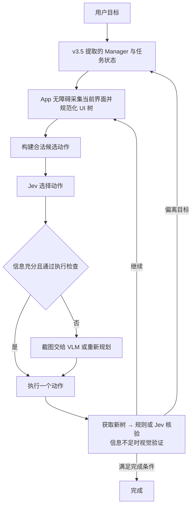

# MobileAgent v3.5 + Jev + Android App 可行性调研

资料核查日期：2026-09-21；方案更新：2026-09-22。结论来自官方仓库、论文、模型文档与本机 CLI 检查；没有运行 Jev API 或真机自动化闭环。代码版本和逐项证据见文末附录。

当前选择为 MobileAgent v3.5 的 Android 衍生项目：公开 Fork 后裁剪无关目录，按需升级或择取上游补丁，允许独立发展。App 自行采集和执行，先自用、不上应用商店；完整决定见[项目方向](../project-direction.md)，设备实现见[手机端专项调研](2026-09-21-on-device-layout-and-mobileagent.md)。

## 结论

**采用 v3.5 规划与视觉能力 + Jev 树决策/核验 + App 无障碍执行，具有明确实现路径。** 对原生控件充分、目标明确的流程，规则和 Jev 可以减少视觉模型调用；开放式多步任务继续由生成式模型规划。尚需通过设备桥和真实任务验证整体可行性。

现有材料足以证明接口能组合，尚不足以证明中文手机任务的成功率、速度或经济性优于成熟 VLM。关键未知是 UI 树覆盖率、Jev 的目标场景准确率，以及设备采集/等待是否成为主要延迟。

## 三个仓库分别提供什么

| 项目 | 已核实的公开内容 | 对本方案的用途 |
|---|---|---|
| [MobileAgent](https://github.com/X-PLUG/MobileAgent) | v3.5 / GUI-Owl-1.5；`mobile_use` 为单模型 ADB 真机示例，`android_world_v3.5` 包含完整四角色 | 选定底座；复用 Android 相关模型/动作处理，提取角色逻辑并解除评测环境耦合 |
| [Qwen-UI-Agent](https://github.com/Tongyi-MAI/Qwen-UI-Agent) | 此独立仓库是技术报告展示网站，README 明确不含 agent/训练/模型实现；指向 MAI-UI | 阅读后继系统设计；当前不能将该网站仓库当可运行框架 |
| [MAI-UI](https://github.com/Tongyi-MAI/MAI-UI) | 原 MAI-UI 有 2B/8B 权重、推理客户端、提示词和部分评测；后继 Qwen-UI-Agent 目录主要是报告与素材 | 参考动作和轨迹结构，或采用其视觉模型；本次未见完整手机执行 runtime |

MobileAgent 最新手机示例以截图喂给 VLM，再解析模型输出并调用 ADB。MAI-UI 虽保存 `accessibility_tree`，实际构造模型消息时未发送它；其 notebook 是对预存截图预测动作，没有驱动真实设备。两者都不能通过替换一个 `model` 参数直接变成 Jev 系统。[MobileAgent 真机循环](https://github.com/X-PLUG/MobileAgent/blob/11cea575561fb7800b5fb6b6cafa56f7a91de11f/Mobile-Agent-v3.5/mobile_use/run_gui_owl_1_5_for_mobile.py)、[MAI-UI 消息构造](https://github.com/Tongyi-MAI/MAI-UI/blob/3deabf1d1fcf31964511929938b7c9485589b29c/MAI-UI/src/mai_naivigation_agent.py#L395)

开源范围也需分层：MobileAgent 根代码 MIT；MAI-UI 代码及已核验 2B/8B 模型卡为 Apache-2.0。具体权重和第三方依赖仍按各自许可证判断。论文中更大模型、训练系统和端云协同的描述，不等于相关权重与运行时已经开放。[MobileAgent LICENSE](https://github.com/X-PLUG/MobileAgent/blob/11cea575561fb7800b5fb6b6cafa56f7a91de11f/LICENSE)、[MAI-UI LICENSE](https://github.com/Tongyi-MAI/MAI-UI/blob/3deabf1d1fcf31964511929938b7c9485589b29c/MAI-UI/LICENSE)、[MAI-UI-8B 模型卡](https://huggingface.co/Tongyi-MAI/MAI-UI-8B)

论文证明了 GUI 操作路线有用，但不能把榜单数字当产品承诺。例如开放 MAI-UI-8B 的 AndroidWorld 成绩是 70.7%；后继 Qwen-UI-Agent 的 82.1% 是 MobileWorld 的 117 个 GUI-only 子集，92.2% 则是作者真机集和 AutoJudge 条件下的成绩，排除了环境错误。评测任务、模型、执行协议和判分器不同，不应横向拼表得出本方案成功率。[MAI-UI 论文](https://arxiv.org/html/2512.22047v1#S3)、[Qwen-UI-Agent 论文](https://arxiv.org/html/2607.28227v1#S3.SS2)

## Android CLI 的开发辅助价值

调研时本机安装的 Google Android CLI 为 `1.0.15985488`。本项目生产通道采用 App 无障碍服务，CLI 仅作为开发和对照工具。检查其发行包确认，默认 `layout` 通过 ADB 执行 `uiautomator dump`，再把 XML 转为 JSON。它读取前台应用暴露的无障碍 UI，不局限于自己开发的 debuggable App。[官方 CLI](https://developer.android.com/tools/agents/android-cli)、[UI Automator](https://developer.android.com/training/testing/other-components/ui-automator-legacy)、[本机检查证据](android-cli-evidence.md)

| 能力 | 接口 | 适用说明 |
|---|---|---|
| 结构化界面 | `android layout --device SERIAL --pretty` | 提供文字、内容描述、资源 ID、交互状态、位置等信息；是 Jev 的输入来源 |
| 截图 | `android screen capture --device SERIAL -o screen.png` | 可交给视觉后备模型 |
| 点击/滑动/返回 | `adb -s SERIAL shell input tap/swipe/keyevent ...` | 实际执行由 ADB 完成，需要本地适配器 |
| 文字输入 | ADB 输入或另建 Unicode 输入桥接 | `adb shell input text` 不能当作可靠的中文输入方案 |

命令来自[官方交互参考](https://developer.android.com/agents/skills/devtools/android-cli/references/interact)及本机 help。调研时设备列表为空，没有采集真实界面或验证上述动作。

有三项直接影响设计的边界：

- **UI 树不等于全部视觉内容。** Compose 语义可以合并，Canvas 可能只有一个整体节点，WebView 和图片图标可能缺少足够信息；有节点也不保证目标没有被遮挡。[Compose semantics](https://developer.android.com/develop/ui/compose/accessibility/semantics)、[交互参考](https://developer.android.com/agents/skills/devtools/android-cli/references/interact)
- **字段与增量接口会漂移。** 本机旧版输出 `resource-id`、`content-desc`，普通节点主要给 `center`；官方网页例子有所不同。最新官方 help 已将 `--diff` 标记为 no-op，新增 `--full/--flat/--no-idle`，因此应固定版本和规范化字段，不依赖旧版 diff 长期可用。[最新 help](https://developer.android.com/agents/skills/devtools/android-cli/skill)、[发行说明](https://developer.android.com/tools/agents/android-cli/release-notes)
- **主机原型与手机产品不同。** CLI 在电脑上运行；真机需要 ADB 调试授权，通常无需 root。脱离电脑需实现 Android 端观察/执行服务，例如用户启用的 AccessibilityService，重新处理生命周期及系统权限。[ADB](https://developer.android.com/tools/adb)、[AccessibilityService](https://developer.android.com/reference/android/accessibilityservice/AccessibilityService)

## Jev 为什么适合这条路线

Jev 是 TypeSafe AI 于 2026-09-15 发布的模型，当前稳定版本 `jev-1.13.0`。它以文本/JSON 为输入，不支持截图，也不生成开放文本；它的优势是对预先定义的候选做结构化决策。[发布公告](https://typesafe.ai/blog/introducing-system-one-models-and-jev)、[State](https://docs.typesafe.ai/concepts/state)

- `Choice`：从最多 255 个候选选择一个，适合选择节点或完整动作。
- `Score`：对定义好的等级评分。
- `Noul`：判断一个明确条件为真的概率，例如当前界面是否符合预期。

这些问题可以同批并行，但彼此独立；不能假设第二个问题读到了第一个答案。工程上优先让 Choice 选完整合法动作，减少“动作类型、目标节点、参数分别选出后不匹配”的情况。[Introduction](https://docs.typesafe.ai/introduction)、[API reference](https://docs.typesafe.ai/api)

例如“进入搜索页”的候选可以是 `tap_search_node`、`scroll_down`、`back`、`wait`、`need_visual`。模型只选一个候选，程序负责映射节点和执行参数。搜索词来自用户、模板或规划模型；坐标计算来自设备观测。Jev 不需要输出任意字符串。[官方闭集 function calling 模式](https://docs.typesafe.ai/cookbooks/function_calling)

官方坦承多跳推理、数值精度、长且无关的上下文和生成任务是弱项；中文等非英语任务需专门测试。其 `confidence` 由概率分布推导，不能直接当作这次点击必然正确的保证；“结构永远有效”和“选对动作”是不同性质。[已知弱项](https://docs.typesafe.ai/model-jaggedness/jev-1.13)、[Confidence](https://docs.typesafe.ai/confidence)

## 当前架构（尚未实现）

需要明确实现的边界：

1. **观测规范化。** 保留可见文字、内容描述、交互属性、父子/同组关系，以及本地可执行的节点位置。过滤无关节点时保留标签与控件关系，不能只留下裸按钮名。App 与评测来源都转换为统一观察 schema。
2. **候选覆盖。** 包含点击、输入已知内容、滚动、返回、等待、完成和转视觉等动作。无合适动作必须能放弃选择；超过 255 个候选时先按区域或相关性分组。
3. **绑定当前观测。** 候选只对当前快照有效；节点编号不是永久身份。执行前核对目标仍在，界面变化则重采样，避免按旧坐标点击。
4. **闭环验证。** 点击命令成功只表示执行器接受了动作。必须检查目标页面、字段值或业务状态，配合重复状态检测、步数预算和恢复路径。
5. **按职责分工。** 已知流程用代码；语义匹配用 Jev；开放规划/文本生成用 LLM；树中缺失的目标用截图 VLM/OCR。UI 内容作为数据处理，尤其网页和消息中的指令不能改写用户目标。

## 适用程度

| 场景 | 判断及条件 |
|---|---|
| 原生设置、列表、明确按钮操作 | 优先验证；UI 语义充分时可减少视觉调用 |
| 固定 App 内的常见业务流程 | 可行；状态机掌握流程，Jev 处理文本变化和候选选择 |
| 多 App、开放目标、长流程 | 混合方案可行；单靠 Jev 连续贪心点击缺少充分依据 |
| Canvas、地图、游戏、无语义图标 | 纯 UI 树路径不足，需要视觉或专门接口 |
| 完全离线、仅手机本地推理 | 当前托管 Jev 路线不满足；开放 GUI 权重是另一部署路线 |
| 手机 App 脱离电脑运行 | 通过无障碍服务 + 云端 Python 编排实现；设备桥、生命周期和连接恢复尚需开发验证 |

## 如何验证

按[阶段规划](2026-09-22-stages-evaluation-and-flows.md)推进：固定 v3.5 入口与模型并建立基线 → 提取/裁剪后复验 → App 设备桥 → Jev 动作选择 → 树核验 → 按需规划 → 完整闭环。复用 AndroidWorld、AndroidControl 和 MobileWorld 等资产，同时补充设备桥边界、核验四态和中文真机任务。

在相同任务、初始状态、模型版本及设备条件下对照，分别报告任务结果、候选覆盖、选择错误、误报成功、视觉回退、恢复、模型费用和端到端耗时。原模型输出不是正确标签，基准终局判据也不直接充当逐步核验标签。

不预设降本比例或性能目标。Jev 的低调用单价提供优化机会，实际收益取决于输入量、回退、任务步数和失败重试；按[成本核算方法](2026-09-22-jev-cost-model.md)统计各入口的实际请求与账单。

## 证据附录

- [Jev 官方能力与限制](jev-evidence.md)
- [MobileAgent 源码与模型证据](mobileagent-evidence.md)
- [MAI-UI 与 Qwen-UI-Agent 仓库边界](tongyi-ui-evidence.md)
- [Android CLI 本机与官方能力核查](android-cli-evidence.md)
