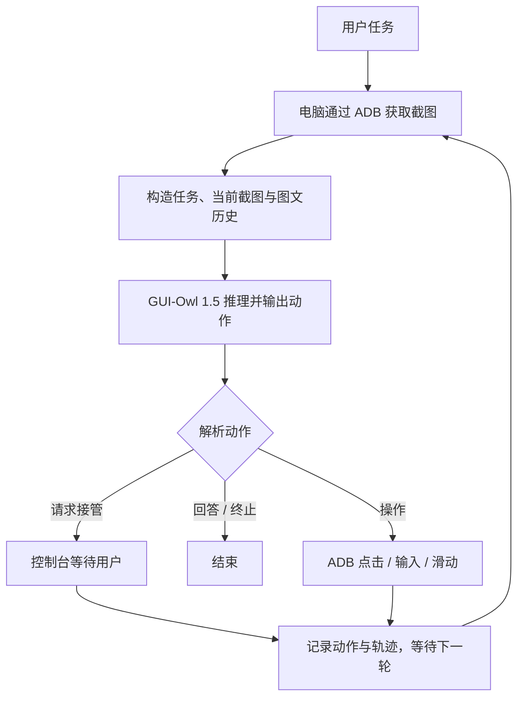
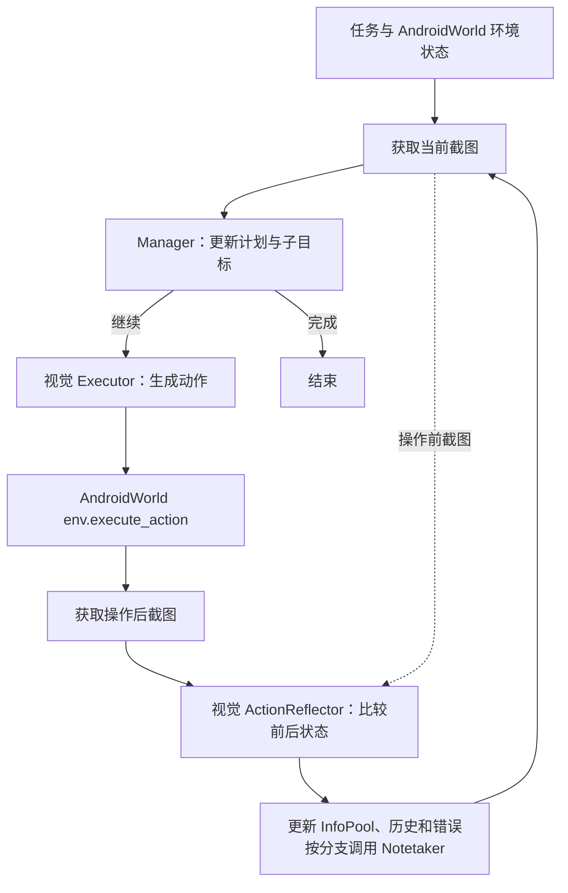
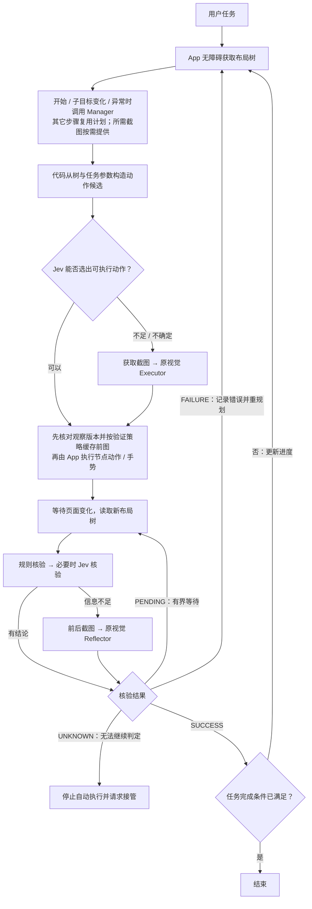

# MobileAgent + Jev：阶段规划、评测复用与流程对比

更新日期：2026-09-22。本文仅规划实施顺序与验证方式，不设成本、速度或成功率提升目标；没有运行模型或手机评测。当前仓库与演进方向见[项目决策](../project-direction.md)。

采用 MobileAgent v3.5：`mobile_use` 是单模型真机参考，所需四角色逻辑从 `android_world_v3.5` 提取并解除环境耦合。设备接口需新增，不能假设 v3.5 已有可直接替换的 App Controller。手机 App 通过无障碍提供观察和执行，Python 控制循环先在开发机运行、后迁到服务端。Jev 承担候选选择及闭集核验，原生成式模型承担规划、内容生成和视觉兜底。Jev 不接收截图，[输入边界见官方文档](https://docs.typesafe.ai/models)。

## 1. 阶段与验证方式

| 阶段 | 实施范围 | 验证方式与产物 | 评测素材 |
|---|---|---|---|
| 0：建立 v3.5 对照并整理代码 | 公开 Fork 并固定代码、模型、入口、任务及 App/系统版本；记录调用和轨迹；提取必要代码后裁剪无关目录 | 先运行所选原版入口，单独记录必要修复；提取四角色及整理目录后复验行为。单模型真机入口、AndroidWorld 四角色入口和提取后的生产编排分组记录，不混用调用数或分数 | AndroidWorld；真机固定任务；后续加入 MobileWorld 的 GUI-only 子集 |
| 1：接入手机设备桥 | 新增统一设备接口；Accessibility 树、节点动作、手势、截图、屏幕版本和命令回执；替换宿主 ADB / AndroidWorld 环境操作 | 保留已建立基线的 VLM 决策与反思。回放已知动作，检查目标及结果；对照 App 树与测试环境树的语义；测试输入法、弹窗、滚动、旋转、过期节点、截图不可用、重连及重复命令 | AndroidWorld 的可控 App；补建带已知状态的测试页面与中文真机样例 |
| 2：接入 Jev 动作选择 | 从树与任务参数用代码构造完整动作候选；Jev 返回候选 ID 或请求视觉；保留原 Executor 兜底 | 先离线评估候选覆盖和选择，再影子运行仅记录 Jev 建议，最后参与真实执行。分别报告候选缺失、选择错误、参数错误、回退和实际操作结果；本阶段保留原验证器与规划频率 | AndroidControl 原始树/动作数据；阶段 0/1 采集轨迹 |
| 3：接入树结果验证 | 按“规则 → 必要时 Jev → 信息不足时视觉”核验；返回 SUCCESS / FAILURE / PENDING / UNKNOWN；明确结果时跳过原视觉 Reflector | 输入目标、动作、预期后置条件、前后树和时间信息；用外部判据或人工标签核查，报告四态混淆、误报成功、误报失败、等待与视觉回退。专门加入点击无效、加载中、错误页面、相似文字及树外变化 | 从可控环境采集并标注四态数据；AndroidWorld/MobileWorld 提供任务终局真值；逐步真值需另补 |
| 4：调整规划调度 | 开始、子目标切换、异常时调用 Manager；其它步骤复用子目标；保留每步验证及必要的生成式能力 | 与阶段 3 使用相同任务/种子对照；观察漏重规划、计划过期、循环、步数、完成质量和调用变化。单独开关按需规划，避免与其它改动混在一起 | AndroidWorld；MobileWorld 跨 App/长任务 |
| 5：完整闭环与真机复核 | 组合各模块，检查断线恢复、进程重启、用户手动操作与停止/恢复；在真实中文 App 运行 | 配对比较原版、仅设备桥、加 JevSelector、加 Verifier、加按需规划。模拟器用独立判分；真机按任务 rubrics 留存证据。拔掉 USB 并停止主机 ADB 后验证 App + 服务端链路 | AndroidWorld/MobileWorld；Mobile-Eval-E 任务；自建中文真机集 |

阶段 2 的影子运行只能检查建议差异，不能证明 Jev 实际控制后的成功率；后者由闭环评测确认。原 VLM 的动作和反思也不是天然正确标签。

App 可以安装进评测模拟器：Agent 的观察与动作走 App DeviceBridge，评测机单独使用原环境的初始化和判分能力。这样能复用现有基准，同时检验真正要上线的设备通道。终局数据库、文件或后台真值只交给评测器，不作为 Jev/Manager 的输入。

## 2. GitHub 上哪些资产可以复用

结论：已有资产覆盖离线动作选择、视觉定位和在线完整任务，但没有与上述阶段一一对应、开箱即用的 Jev + 无障碍 App 测试套件。

| 资源 | 已公开资产 | 本项目复用方式 | 需要补充或转换 |
|---|---|---|---|
| MobileAgent v3.5 的 AndroidWorld 目录及上游 AndroidWorld | Agent 适配、运行脚本、任务定义、初始化/清理和自动成功判据 | 阶段 0/4/5 的可重复闭环；阶段 1 的受控页面；运行时收集树和截图 | 将提取后的生产编排接入统一评测接口；原真机单模型入口与四角色入口不是同一实现，均需标注并分别验证 |
| Google AndroidControl | 目标、逐步指令、截图、无障碍树、动作及数据划分文件 | 阶段 2 离线候选/选择验证；建立统一观察格式 | 将树转为本项目 schema；从原始树构造候选。不能用参考动作或标注 bbox 反向生成候选；成功示范缺乏完整失败/等待标签 |
| Tongyi-MAI/MobileWorld | 任务、容器环境、自托管 App 后端、快照复位、运行器、多类独立成功判据 | 阶段 4/5 的较长任务和跨 App 评测，先选 GUI-only | App DeviceBridge 接入；环境权限与初始化不等于普通手机能力；对 MCP/用户交互任务分别分组，避免混合口径 |
| Mobile-Agent-E 的 Mobile-Eval-E | 5 个场景、25 个任务的指令、App、评分 rubrics、人工参考操作 | 阶段 5 的跨 App 真机任务素材与人工验收方式 | 自行采集树/截图/结果；数据本身不是自动评分器，真实 App 版本与内容变化需适配 |
| MAI-UI/evaluation/grounding；MobileAgent v3.5 grounding | 视觉定位标注与评测脚本；MAI-UI 包含 ScreenSpot_V2 的 mobile/web/desktop 标注等 | 验证原视觉兜底模型的点击定位，优先 mobile 子集 | 图片按各数据集说明下载；这些不是完整无障碍树数据，不能直接用来测 Jev 树决策 |
| MobileAgent/GUI-Critic-R1 的 GUI-Critic-Test | 测试样本、执行前动作错误判断及评测代码 | 可选补充：动作执行前的视觉检查 | 执行前预测不同于执行后核验；截图样本不能直接充当 Jev 四态树验证集 |
| Qwen-UI-Agent 项目资料 | 网页、论文和评测结果展示；实际资产需逐项看对应仓库/目录 | 查模型及 benchmark 关联关系 | 本次未找到可直接下载并运行的 MobileWorld-Real 完整任务/环境/判分包，不把其榜单数字当成可复用评测集 |

主要来源：

- [v3.5 AndroidWorld 运行脚本](https://github.com/X-PLUG/MobileAgent/blob/11cea575561fb7800b5fb6b6cafa56f7a91de11f/Mobile-Agent-v3.5/android_world_v3.5/run_ma35.sh)、[AndroidWorld 上游](https://github.com/google-research/android_world)、[任务判据说明](https://github.com/google-research/android_world/blob/main/docs/tasks_guide.md)。
- [AndroidControl 数据格式与获取方式](https://github.com/google-research/google-research/blob/master/android_control/README.md)。数据提供参考行为，离线匹配时需处理等价动作；不能把参考轨迹中的唯一动作当成唯一合法行为。
- [MobileWorld 环境、任务及判分](https://github.com/Tongyi-MAI/MobileWorld/blob/3b8b6d7ba8ace72386372e32f6d088efd430c92a/README.md)、[真机说明](https://github.com/Tongyi-MAI/MobileWorld/blob/3b8b6d7ba8ace72386372e32f6d088efd430c92a/docs/real-devices.md)。它的完整容器环境要求 Linux/KVM 等条件，当前 Mac 可作开发机，完整评测环境另行准备；真机示例仍经主机 ADB，不证明 App 已能自行运行。
- [Mobile-Eval-E 数据](https://github.com/X-PLUG/MobileAgent/tree/11cea575561fb7800b5fb6b6cafa56f7a91de11f/Mobile-Agent-E/data/Mobile-Eval-E)、[数据卡](https://huggingface.co/datasets/mikewang/mobile_eval_e)、[论文人工评测说明](https://arxiv.org/html/2501.11733v1#S3)。
- [MAI-UI grounding 目录](https://github.com/Tongyi-MAI/MAI-UI/tree/3deabf1d1fcf31964511929938b7c9485589b29c/MAI-UI/evaluation/grounding)、[MobileAgent grounding 脚本](https://github.com/X-PLUG/MobileAgent/blob/11cea575561fb7800b5fb6b6cafa56f7a91de11f/Mobile-Agent-v3.5/grounding_and_kb/run_grounding.sh)。
- [GUI-Critic-R1 说明](https://github.com/X-PLUG/MobileAgent/blob/11cea575561fb7800b5fb6b6cafa56f7a91de11f/GUI-Critic-R1/README.md)、[样本](https://github.com/X-PLUG/MobileAgent/blob/11cea575561fb7800b5fb6b6cafa56f7a91de11f/GUI-Critic-R1/test_files/gui_i.jsonl)、[Qwen-UI-Agent 仓库](https://github.com/Tongyi-MAI/Qwen-UI-Agent)、[MAI-UI 总入口](https://github.com/Tongyi-MAI/MAI-UI)。

一个具体接入缺口：MobileWorld 底层有 XML 获取函数，但该固定版本的标准 `get_observation` 对 accessibility_tree 模式仍报不支持；不能当成树接口已打通。[客户端源码](https://github.com/Tongyi-MAI/MobileWorld/blob/3b8b6d7ba8ace72386372e32f6d088efd430c92a/src/mobile_world/runtime/client.py#L134)

MobileAgent 的 UI-S1 也提供 AndroidControl 的转换格式和离线评测脚本，但该转换文件没有完整原始树。因此本项目优先读取 Google 原始数据，可参考 UI-S1 的动作格式和评分实现。[UI-S1 评测数据](https://github.com/X-PLUG/MobileAgent/blob/11cea575561fb7800b5fb6b6cafa56f7a91de11f/UI-S1/evaluation/dataset/android_control_evaluation_std.jsonl)

## 3. 需要自建的最小评测材料

1. **设备桥用例。**已知 UI 状态与动作结果；节点失效、重叠窗口、输入法、列表回收、语义缺失、自绘页面、截图失败和用户抢先操作等。树不与内部 View 层级逐字匹配，检查实际需要的语义与可执行目标。
2. **动作选择样本。**`任务/当前子目标 + 当前树 + 独立生成的候选 → 可接受动作集合`。分别统计候选是否覆盖合理动作、Jev 是否选对、参数是否完整。无需从原动作坐标猜出不存在的节点 ID。
3. **操作后核验样本。**`子目标 + 动作 + 预期后置条件 + 前后树 + 时间信息 → 四态标签 + 外部证据`。加入真实错误/无效动作和不同加载阶段；人为构造的缺失树用于测试“不足以判断”，不要冒充真实执行失败。
4. **真实中文 App 任务。**从自用任务选取，记录 App/系统版本、起始状态、人工 rubrics 和完成证据；与英语基准分开报告。

AndroidWorld/MobileWorld 的终局判据只表示整个任务是否完成。任务尚未完成时，一次中间操作仍可能成功；不能把终局 false 自动标成所有中间步骤 FAILURE。逐步标签需要针对动作的后置条件、测试页面状态或人工审核。

数据按任务/轨迹划分；有条件时再按 App 留出，避免同一轨迹相邻帧落入开发集和测试集。使用开发集选择裁剪、置信度和回退规则，冻结后再测留出集。参考答案、未来帧和评测器数据库不可进入决策输入。

每组报告任务成功率、步骤数、错误类型、候选覆盖、视觉回退、误报成功、延迟、各角色输入/缓存/输出用量和账单；统计全部尝试的总费用及每个成功任务分摊的费用。环境初始化失败与 Agent 失败分开，并重复运行相同任务种子以显示波动，不预设改善幅度。

## 4. 截图与验证衔接

“需要时上传截图”和“需要时才采集截图”是两个独立选择。原 Reflector 需要操作前后两张图；操作后发现树不足时，已无法补拍历史画面。

阶段 1–3 先在设备本地保留操作前截图，仅在视觉验证需要时上传前后图；同时保留截图采集和上传次数两项统计。若后续希望连采集也完全按需，则为无前图情况设计“前树 + 动作 + 后图”的新验证分支，单独验证效果，不声称它与原前后图 Reflector 等价。截图不可用时保留 UNKNOWN，不能转换为 SUCCESS。

原 Manager 仍依赖截图时，按需规划也可能需要图像；“截图只在 Executor 失败时使用”不准确。规划、视觉定位和视觉验证都可能触发图像需求。

## 5. 改造前后的流程

v3.5 真机单模型示例与 AndroidWorld 四角色编排分别画出，避免把两个入口混成同一条原版流程。以下为正常动作主路径，省略请求重试、解析失败和部分提前结束分支。[真机源码](https://github.com/X-PLUG/MobileAgent/blob/11cea575561fb7800b5fb6b6cafa56f7a91de11f/Mobile-Agent-v3.5/mobile_use/run_gui_owl_1_5_for_mobile.py)、[四角色源码](https://github.com/X-PLUG/MobileAgent/blob/11cea575561fb7800b5fb6b6cafa56f7a91de11f/Mobile-Agent-v3.5/android_world_v3.5/android_world/agents/mobile_agent_v3.py)

### 改造前：v3.5 真机单模型示例

这个入口通过下一轮截图和历史继续决策，没有独立 Manager、Reflector 或 Notetaker，不能套用每步固定三次模型调用的成本假设。

### 改造前：v3.5 AndroidWorld 四角色参考

该入口提供要复用的多角色逻辑，同时带有环境依赖、固定尺寸和任务特例。提取到生产编排后需建立自己的对照，不能直接引用论文成绩证明改造效果。

### 改造后：App 设备桥 + 树优先 + Jev + 按需视觉

以下为分阶段完成后的拟议流程，尚未实现；阶段 1–3 保留原规划频率，到阶段 4 才单独验证按需规划。

运行时的任务完成条件来自任务/计划及可观察证据；基准环境的独立 evaluator 在旁路判分，不进入上述决策循环。等待、错误重试和循环均需有界；任务暂停/恢复和用户停止是所有阶段共享的控制通道。
