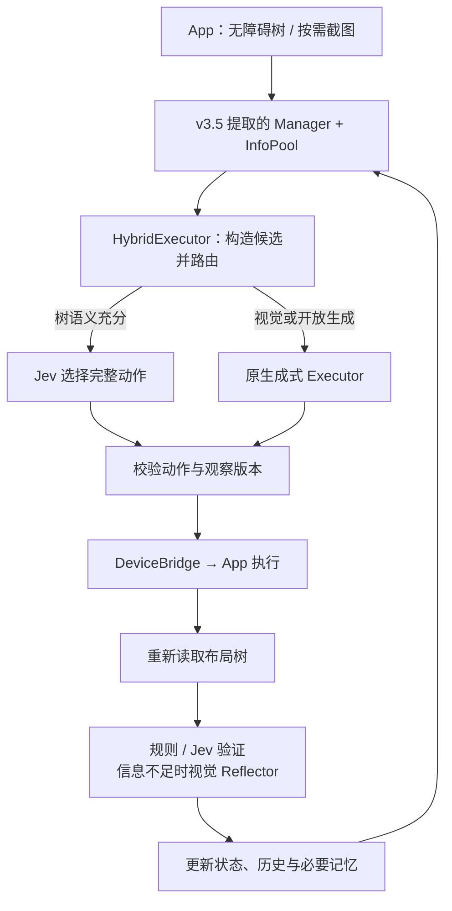

# MobileAgent v3.5 接入 Jev：复用边界与改造接口

更新日期：2026-09-22。源码核查基线为 `11cea575561fb7800b5fb6b6cafa56f7a91de11f`；未运行模型、手机或 benchmark。当前选择为公开 Fork 后裁剪的 v3.5 Android 衍生项目，见[项目方向](../project-direction.md)。以下明确区分上游已有能力与拟新增模块。

## 1. 两个入口的真实边界

| 能力 | v3.5 真机 `mobile_use` | v3.5 `android_world_v3.5` |
|---|---|---|
| 规划 | 单 VLM 根据任务与图文历史决策，无独立 Manager | Manager 显式生成/更新子目标 |
| 历史与记忆 | 近四轮图文历史及更早动作摘要，无独立 Notetaker | InfoPool、历史、Notetaker；存在按测试任务启停的分支 |
| 视觉 | 当前截图及图文历史输入 VLM | 各角色按提示词使用截图 |
| 执行 | AdbTools 与动作分派 | AndroidWorld `env.execute_action` |
| 操作后反思 | 没有独立验证器，通过下一轮上下文继续决策 | ActionReflector 比较操作前后状态，结果仍是模型判断 |
| 树观察与节点动作 | 未接入 App 的无障碍树 | 不能把评测环境能力直接视为普通 APK 能力 |
| 用户接管 | `interact/call_user` 为控制台等待 | 没有完整 App 会话接管协议 |
| 手机独立运行 | 依赖宿主与 ADB | 依赖宿主和 AndroidWorld 环境 |

来源：[真机入口][mobile]、[图文历史与 API 封装][utils]、[四角色调用入口][agent]、[角色与 InfoPool][roles]。

本项目复用真机入口的模型/动作处理，并从 AndroidWorld 入口提取需要的 Manager、Executor、ActionReflector、Notetaker 和 InfoPool。提取时移除环境依赖、固定屏幕尺寸和任务特例；不是将整个 benchmark 环境作为 App 的运行时。具体代码接口仍需开发验证。

## 2. 能力复用矩阵

| 能力 | 可以保留 | 必须新增或适配 |
|---|---|---|
| 任务规划 | Manager 提示词、子目标与错误反馈、状态结构 | 脱离评测环境的输入；后续单独验证按需规划 |
| 工作记忆 | 动作/结果/错误历史、重要信息、Notetaker 逻辑 | 观察版本、决策来源、会话检查点；按配置控制摘要调用 |
| 动作选择 | 原视觉 Executor 作后备 | 树规范化、完整动作候选、JevSelector、视觉回退路由 |
| 手机执行 | 动作类型与协议可参考原实现 | App 无障碍树、节点动作、手势、截图及设备桥 |
| 结果验证 | 原视觉 ActionReflector | 规则与 Jev 四态验证，未知/等待处理，前图缓存策略 |
| 错误恢复 | 角色反馈和已有重试机制 | 观察过期、命令去重、网络断开、进程重启后的任务状态处理 |
| 用户接管 | 借鉴 `interact` 的语义 | App 暂停、停止、恢复、权限/连接状态和手动操作冲突处理 |

规划、自由文本、摘要和视觉理解仍依赖生成式模型。Jev 只能在给定候选之间选择或作结构化判断，不能替换所有角色共享的 VLM，也不能独自补齐未知输入文本、坐标或计划。[Jev 官方输入输出边界](https://docs.typesafe.ai/models)

## 3. 拟新增的模块边界

以下名称是接口建议，上游尚未提供这些完整能力。

1. **设备接口与 App DeviceBridge。**`observe()` 返回树、窗口、尺寸、时间、观察版本和按需截图；`execute()` 接受已验证动作，返回提交状态、回执及后续观察。替换 ADB 或 `env.execute_action` 时，上层不直接依赖具体设备后端。
2. **HybridExecutor。**代码依据子目标、当前树和已知参数生成完整候选；Jev 返回候选 ID，程序查表得到动作。无合适候选或需要视觉时调用原 Executor。自由输入由任务参数、模板或生成式模型提供。
3. **统一动作与结果。**动作携带类型、目标、参数、观察版本和来源，经过校验后执行；不要为适配原文本解析器伪造模型 Thought。命令受理、动作产生效果与任务完成分别记录。
4. **ResultVerifier。**先用明确规则核验，再由 Jev 判断语义；输出 `SUCCESS / FAILURE / PENDING / UNKNOWN`。输入包括子目标、动作、预期后置条件、前后树和时间。信息不足时转视觉，仍不足时保留 UNKNOWN。
5. **任务与设备会话。**检查候选绑定的观察仍然有效；页面变化时拒绝旧动作并重新观察。建立命令去重、超时、取消、暂停/恢复及检查点，防止模型或网络重试重复执行。

这张图展示模块职责；等待、结束、失败和接管等分支见[完整流程图](2026-09-22-stages-evaluation-and-flows.md#5-改造前后的流程)。

## 4. 截图与设备能力

App 使用用户启用的 AccessibilityService 读取语义节点、执行节点动作和手势；截图 API 从 Android 11 / API 30 提供，仍受窗口和系统限制。首期不需要 root、Shizuku 或完整 Android CLI。[AccessibilityService](https://developer.android.com/reference/android/accessibilityservice/AccessibilityService)、[AccessibilityNodeInfo](https://developer.android.com/reference/android/view/accessibility/AccessibilityNodeInfo)

保留原前后图 Reflector 时，应在动作前缓存前图，树验证不足再上传前后图。若改为完全按需采集，则需要验证“前树 + 动作 + 后图”的新验证路径，不能宣称与原 Reflector 等价。截图失败不能被转换成验证成功。

Python 编排先在开发电脑运行，后部署普通服务器；App 通过网络连接，运行时无需电脑。若将来要把编排也迁入 APK，应保持观察、动作和会话协议，另行处理 Android 运行时与生命周期。

## 5. 同步成本与验证

公开 Fork 后只保留实际使用的 Android 代码和必要评测资产。设备、Jev 和模型适配分别集中管理，角色提示词及状态逻辑保留来源记录，以便将来择取上游补丁。目录裁剪与行为改造分开提交；完整升级不合适时可以按语义移植，允许独立发展。

先固定原入口与模型并跑基线，完成提取/裁剪后复验，再逐项接入设备桥、JevSelector、树验证和按需规划。上游的图像路径处理、动作覆盖、坐标换算存在待实测的源码疑点；基线修复应单独记录，详见[工程问题证据](mobileagent-evidence.md#当前示例的具体工程问题)。

角色输出不是独立正确标签，AndroidWorld 的客观 evaluator 也不应成为 Agent 输入。评测任务、树选择样本、四态验证材料与具体阶段见[验证方案](2026-09-22-stages-evaluation-and-flows.md)。

[mobile]: https://github.com/X-PLUG/MobileAgent/blob/11cea575561fb7800b5fb6b6cafa56f7a91de11f/Mobile-Agent-v3.5/mobile_use/run_gui_owl_1_5_for_mobile.py
[utils]: https://github.com/X-PLUG/MobileAgent/blob/11cea575561fb7800b5fb6b6cafa56f7a91de11f/Mobile-Agent-v3.5/mobile_use/utils.py
[agent]: https://github.com/X-PLUG/MobileAgent/blob/11cea575561fb7800b5fb6b6cafa56f7a91de11f/Mobile-Agent-v3.5/android_world_v3.5/android_world/agents/mobile_agent_v3.py
[roles]: https://github.com/X-PLUG/MobileAgent/blob/11cea575561fb7800b5fb6b6cafa56f7a91de11f/Mobile-Agent-v3.5/android_world_v3.5/android_world/agents/mobile_agent_v3_agent.py
